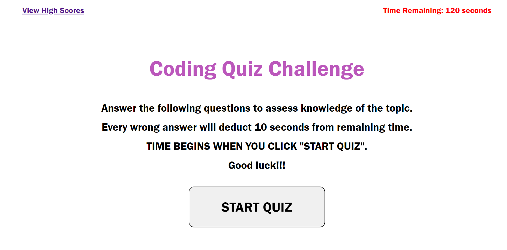

# TIMED-QUIZ-CHALLENGE
* This project shows a timed quiz about JavaScript. 
* It consists of five questions with multiple choices. 
* Every wrong answer will deduct seconds from remaining time. 
* Scores and initials are also stored and can be cleared when the user wants to. 

* The URL to the deployed application is: https://jenina52112.github.io/NEW-TIMED-QUIZ-CHALLENGE/

